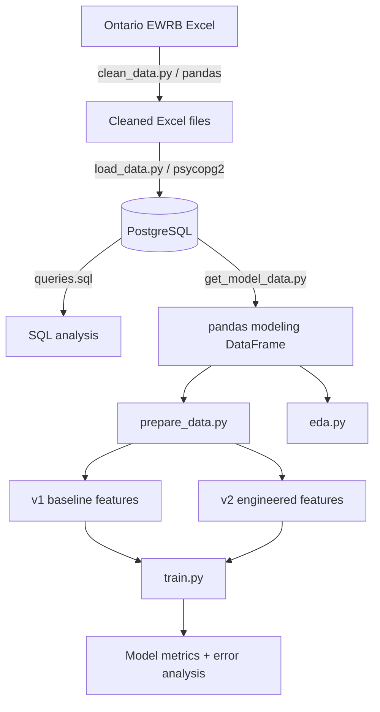
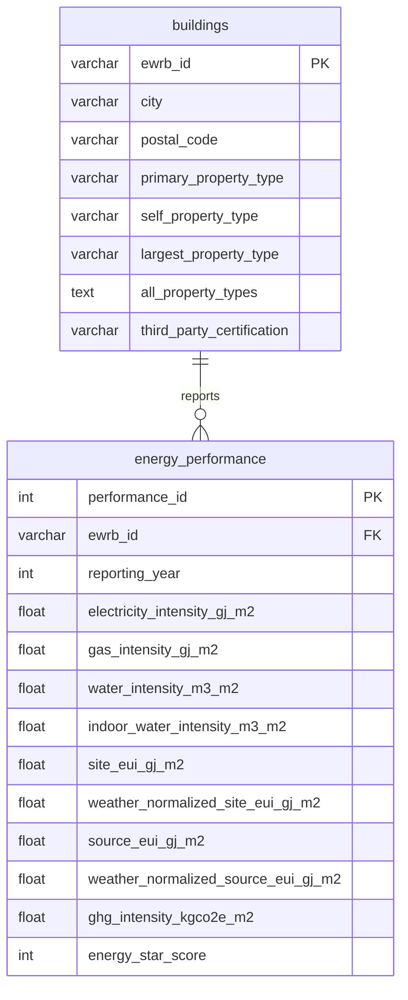

# Ontario Building Energy Intensity: SQL + ML Pipeline

An end-to-end data engineering, SQL, and machine learning project using Ontario's public Energy and Water Reporting and Benchmarking (EWRB) dataset. The project takes building-energy data from raw Excel files through cleaning, PostgreSQL storage, SQL analysis, feature engineering, exploratory analysis, and supervised regression experiments.

## Quick Results

- **6,739** building records in the 2024 source dataset
- **6,379** observations available for supervised learning after removing rows with a missing `site_eui_gj_m2` target
- PostgreSQL relational design with separate `buildings` and `energy_performance` tables
- Controlled **v1 vs v2** feature-engineering experiment using the same deterministic train/test split
- **Primary model-selection metric: MAE**, with RMSE and R² also reported
- Recorded best experiment: **Random Forest + log1p target + v2 features**
- Recorded performance: **MAE 0.538 GJ/m², RMSE 2.238 GJ/m², R² 0.115**

> Re-run `python -m src.models.train` before treating the recorded metrics above as the final benchmark. The repository is designed so the experiments can be reproduced from the same data and split procedure.

## Overview

The pipeline is:

```text
Ontario EWRB Excel dataset
        │
        ▼
   pandas cleaning
        │
        ▼
Cleaned building + energy datasets
        │
        ▼
     PostgreSQL
     ┌────┴─────┐
     ▼          ▼
 SQL analysis   Modeling dataset
                   │
                   ▼
            Python feature engineering
                   │
          ┌────────┴────────┐
          ▼                 ▼
         v1                v2
   baseline features   + engineered features
          │                 │
          └────────┬────────┘
                   ▼
          regression experiments
                   │
                   ▼
          evaluation + error analysis
```

The goal is not simply to maximize a model score. The project emphasizes reproducibility, database design, leakage-aware feature selection, model comparison, and honest analysis of the dataset's limitations.

## Dataset

The project uses Ontario's **Energy and Water Reporting and Benchmarking (EWRB)** dataset for the 2024 reporting year. The Ontario Data Catalogue describes the dataset as covering energy, water, GHG-intensity, and property-use information for large buildings in Ontario and notes that the published data is not cleansed and may contain errors.

**Official source:** [Ontario Data Catalogue — Energy and water usage of large buildings in Ontario](https://data.ontario.ca/en/dataset/energy-and-water-usage-of-large-buildings-in-ontario)

The repository's local raw file is:

```text
data/raw/odc_final_dataset_2024.xlsx
```

The repository intentionally excludes raw and processed datasets from Git via `.gitignore`. Download the 2024 dataset from the official Ontario source and place it in `data/raw/` before running the cleaning pipeline.

### Data used in this project

The source contains 31 columns and 6,739 building records. The project separates the data into:

- **Building characteristics:** EWRB ID, city, postal FSA, property types, property-use descriptions, and third-party certification
- **Energy performance:** electricity/gas/water intensity, Site EUI, weather-normalized EUI, source EUI, GHG intensity, and ENERGY STAR score

## Architecture



## Database Design

The database is normalized around two core tables:



Key design decisions:

- `buildings.ewrb_id` is the primary key.
- `energy_performance.ewrb_id` is a foreign key to `buildings`.
- `energy_performance` uses an identity-generated `performance_id`.
- `(ewrb_id, reporting_year)` is unique, enforcing at most one performance record per building per reporting year.
- The schema is designed to support additional reporting years later, even though only 2024 is currently loaded.

See [`database/schema.sql`](database/schema.sql).

## SQL Analysis

[`database/queries.sql`](database/queries.sql) contains 10 commented analysis queries covering:

- `JOIN`
- `GROUP BY` and aggregation
- `NULL` handling
- `CASE` expressions
- `ORDER BY` / `LIMIT`
- a common table expression (CTE)
- a window function using `RANK() OVER (PARTITION BY ... )`

The queries cover questions such as average Site EUI by property type, high-GHG buildings, water intensity by city, missing intensity readings, efficiency tiers, city-vs-overall GHG comparisons, and within-property-type EUI rankings.

## Data Cleaning

`src/data/clean_data.py` loads the raw Excel file with pandas and creates two cleaned datasets aligned to the PostgreSQL schema.

Key cleaning steps include:

- converting `Not Available` sentinel values to missing values where appropriate
- coercing energy-intensity fields to numeric types
- converting ENERGY STAR scores to nullable integers
- cleaning the Unicode replacement character from affected EWRB IDs
- renaming source columns to descriptive database-friendly names
- adding `reporting_year = 2024`
- splitting building characteristics from yearly energy-performance measures

The cleaned files are written to `data/processed/`.

## Exploratory Data Analysis

`src/models/eda.py` examines the modeling dataset before training and generates plots under `reports/eda/`.

Current analysis includes:

- target distribution and outlier analysis
- missing-value counts and visualization
- Site EUI by property type
- Site EUI by the most common cities
- correlations among numeric variables
- property-type redundancy
- one-row-per-building verification

### Main findings

- `site_eui_gj_m2` is extremely right-skewed. In the initial analysis, the median was approximately **0.737 GJ/m²**, the mean approximately **5.07 GJ/m²**, and the maximum approximately **16,117 GJ/m²**.
- Missingness is concentrated in several fields, including third-party certification, indoor water intensity, ENERGY STAR score, and some energy-intensity variables.
- Several energy-performance variables are extremely correlated with Site EUI. These were treated as **target-adjacent / potential leakage variables** and excluded from the initial predictor set rather than used simply to inflate model performance.
- The three property-type columns overlap heavily; all three matched on approximately **92.6%** of the cleaned modeling rows.

## Machine Learning

The target is:

```text
site_eui_gj_m2
```

### Feature sets

**v1 — baseline**

- `primary_property_type`
- `self_property_type`
- `largest_property_type`
- `city`
- `postal_code` (used as a categorical Canadian postal FSA, not a numeric variable)

**v2 — engineered**

v2 contains the v1 features plus:

- `n_property_types` — count of property-use types listed in `all_property_types`
- `is_certified` — whether a third-party certification field is populated
- `has_data_center` — whether `Data Center` appears in `all_property_types`

These engineered features are derived from building characteristics rather than alternate measurements of energy consumption.

### Experiment design

- Deterministically sort by `ewrb_id` before splitting because the PostgreSQL query does not specify an `ORDER BY`.
- Use an **80/20 train/test split** with `random_state=42`.
- Keep the underlying split reproducible across v1 and v2.
- Evaluate five experiments per feature set:
  - Median baseline
  - Linear Regression
  - Linear Regression with `log1p` target
  - Random Forest
  - Random Forest with `log1p` target
- Evaluate every model on the original Site EUI scale using **MAE, RMSE, and R²**.
- Select the primary model using **MAE** because the target contains extreme outliers that can dominate RMSE.

### Recorded results

| Model | v1 MAE | v2 MAE | v1 R² | v2 R² |
|---|---:|---:|---:|---:|
| Median Baseline | 0.560 | 0.560 | -0.018 | -0.018 |
| Linear Regression | 14.681 | 15.821 | -685.620 | -700.460 |
| Random Forest | 0.876 | 0.599 | -5.359 | 0.107 |
| Random Forest (log1p) | 0.545 | **0.538** | 0.036 | **0.115** |

**Recorded best experiment:** Random Forest with `log1p` target and v2 features — **MAE 0.538 GJ/m², RMSE 2.238 GJ/m², R² 0.115**.

The strongest feature-engineering result is the v2 Random Forest improvement: adding three non-energy building features moved the raw-target Random Forest from an R² of **-5.359** in v1 to **0.107** in v2.

Linear Regression is included for transparency. It performs substantially worse than the other tested approaches on this feature representation; the project does not claim a single root cause for that behavior without further investigation.

## Error Analysis and Data Quality

The training script reports the largest absolute prediction errors together with building identifiers, property types, city, postal FSA, actual EUI, predicted EUI, and signed error.

The extreme Site EUI observations were investigated alongside related gas-intensity values. Some of the largest observations have gas-intensity readings far outside the normal range, making them plausible data-quality anomalies. They were **not silently removed** from the modeling dataset.

The project therefore treats these cases as a documented limitation and keeps the original observations available for reproducibility and further investigation.

## Tests

The repository includes `pytest` tests for both source-data assumptions and feature engineering.

### Data-quality tests

`tests/test_data_quality.py` checks:

- expected columns are present
- `ewrb_id` is unique in `buildings`
- `(ewrb_id, reporting_year)` is unique in `energy_performance`
- every energy-performance record has a matching building
- Site EUI is non-negative
- reporting years fall within a plausible range

### Feature-engineering tests

`tests/test_prepare_data.py` uses small synthetic DataFrames to test:

- target-row removal
- engineered-feature creation
- property-use counting
- certification and data-center flags
- feature-set selection
- preprocessing construction

The tests avoid database I/O and can run independently of PostgreSQL.

## Project Structure

```text
EnergyConsumptionPredictionSystem/
├── data/
│   ├── raw/                         # local source data; gitignored
│   └── processed/                   # cleaned Excel files; gitignored
├── database/
│   ├── schema.sql                  # PostgreSQL DDL
│   └── queries.sql                 # SQL analysis
├── reports/
│   └── eda/                        # generated EDA plots
├── src/
│   ├── data/
│   │   ├── clean_data.py           # raw Excel -> cleaned Excel
│   │   └── inspect_data.py          # source-schema inspection helpers
│   ├── database/
│   │   ├── connection.py           # PostgreSQL connection via .env
│   │   ├── load_data.py             # cleaned Excel -> PostgreSQL
│   │   └── get_model_data.py        # PostgreSQL -> pandas modeling data
│   └── models/
│       ├── eda.py                   # EDA + plots
│       ├── prepare_data.py           # feature preparation + split
│       └── train.py                  # model experiments + evaluation
├── tests/
│   ├── conftest.py
│   ├── test_data_quality.py
│   └── test_prepare_data.py
├── .gitignore
├── requirements.txt
└── README.md
```

## Setup

### 1. Create and activate a virtual environment

**Windows PowerShell**

```powershell
python -m venv .venv
.venv\Scripts\Activate.ps1
```

**macOS / Linux**

```bash
python -m venv .venv
source .venv/bin/activate
```

### 2. Install dependencies

```bash
pip install -r requirements.txt
```

### 3. Obtain the data

Download the 2024 English EWRB dataset from the [Ontario Data Catalogue](https://data.ontario.ca/en/dataset/energy-and-water-usage-of-large-buildings-in-ontario) and place it at:

```text
data/raw/odc_final_dataset_2024.xlsx
```

### 4. Configure PostgreSQL

Create a local PostgreSQL database and a `.env` file in the project root containing:

```text
DB_NAME=your_database
DB_USER=your_username
DB_PASSWORD=your_password
DB_HOST=localhost
DB_PORT=5432
```

`.env` is ignored by Git and should never be committed.

### 5. Create the database schema

Run `database/schema.sql` against the PostgreSQL database.

For example:

```bash
psql -d your_database -f database/schema.sql
```

### 6. Clean the source data

```bash
python -m src.data.clean_data
```

### 7. Load the cleaned data into PostgreSQL

```bash
python -m src.database.load_data
```

### 8. Build the modeling dataset

```bash
python -m src.database.get_model_data
```

### 9. Run SQL analysis

Run `database/queries.sql` directly in PostgreSQL/pgAdmin or with `psql`.

### 10. Run EDA

```bash
python -m src.models.eda
```

Generated plots are written to `reports/eda/`.

### 11. Run model experiments

```bash
python -m src.models.train
```

### 12. Run tests

```bash
pytest tests/
```

## Limitations

- Only the 2024 reporting year is currently loaded, so there is no year-over-year modeling yet.
- Site EUI contains extreme observations that may represent data-quality anomalies.
- Several potentially useful variables have substantial missingness.
- The current predictor set is mostly property type and location metadata, so it cannot capture important structural/operational characteristics such as floor area, building age, occupancy, or HVAC configuration.
- Several energy-related variables are not appropriate independent predictors because they are alternate or closely related measures of energy performance.
- The current best model explains only a modest fraction of target variance, so it should be treated as an experimental baseline rather than a production forecasting system.

## Future Improvements

- Add a dedicated data-quality flagging layer for implausible observations while preserving the original data.
- Investigate additional non-energy building characteristics that can be obtained without introducing target leakage.
- Evaluate other approaches for high-cardinality categorical variables.
- Incorporate multiple reporting years to enable historical and year-over-year features.
- Revisit the final model pipeline with additional validation and hyperparameter tuning after the feature set is established.

## Why this project

This project combines three areas of practical engineering work in one pipeline:

1. **Data engineering:** cleaning raw public data and building a reproducible ingestion path.
2. **SQL/database engineering:** designing relational tables, constraints, joins, CTEs, and window-function queries.
3. **Machine learning:** constructing a leakage-aware feature set, comparing regression approaches, evaluating on multiple metrics, and investigating model errors rather than optimizing a single score blindly.
